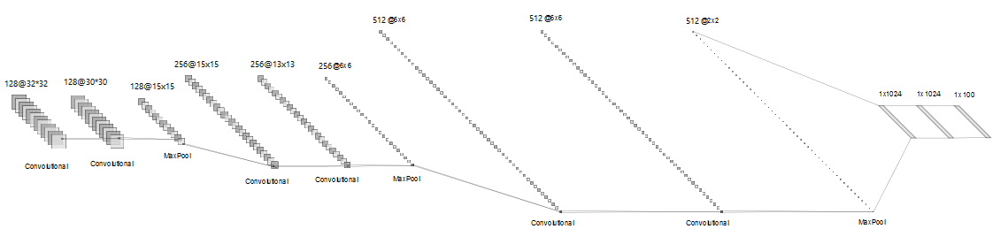

# Convolutional Neural Network

Instead of using Feed-Forward Neural Networks as in the previous assignment, this exercise aims to implement a Convolutional Neural Network (CNN), for solving two image classification problems: [German Traffic Sign Recognition Benchmark](https://benchmark.ini.rub.de/gtsrb_news.html) and [Cifar-100](https://web.stanford.edu/~hastie/CASI_files/DATA/cifar-100.html).

## Implementation

The base implementation in Python with the tensorflow library is given and the aim is to decide on the following factors:

- Architecture of your net.
- Optimization parameters and algorithms to train the net.
- Performance improvement (regularization, data augmentation, etc.)

For the [German Traffic Sign Recognition Benchmark](https://benchmark.ini.rub.de/gtsrb_news.html), multiple classic CNN architectures were tested, including LeNet, AlexNet and VGG-16 pre-trained. On the other side, a custom architecture was used for classifying the [Cifar-100](https://web.stanford.edu/~hastie/CASI_files/DATA/cifar-100.html) dataset, presented below.

## Results

The best performance found for the [German Traffic Sign Recognition Benchmark](https://benchmark.ini.rub.de/gtsrb_news.html) was using the model AlexNet without any pretraining, with little difference compared to the VGG-16. The validation accuracy was of 95.56\%.

The custom architecture developed for the [Cifar-100](https://web.stanford.edu/~hastie/CASI_files/DATA/cifar-100.html) achieved a 50.08\% of validation accuracy, much better than in previous assignment with 27.88\%.

## Authors

- Student Name 1: Stefano Baggetto
- Student Name 2: Giorgio Segalla
- Student Name 3: Angel Igareta ([angel@igareta.com](angel@igareta.com))
